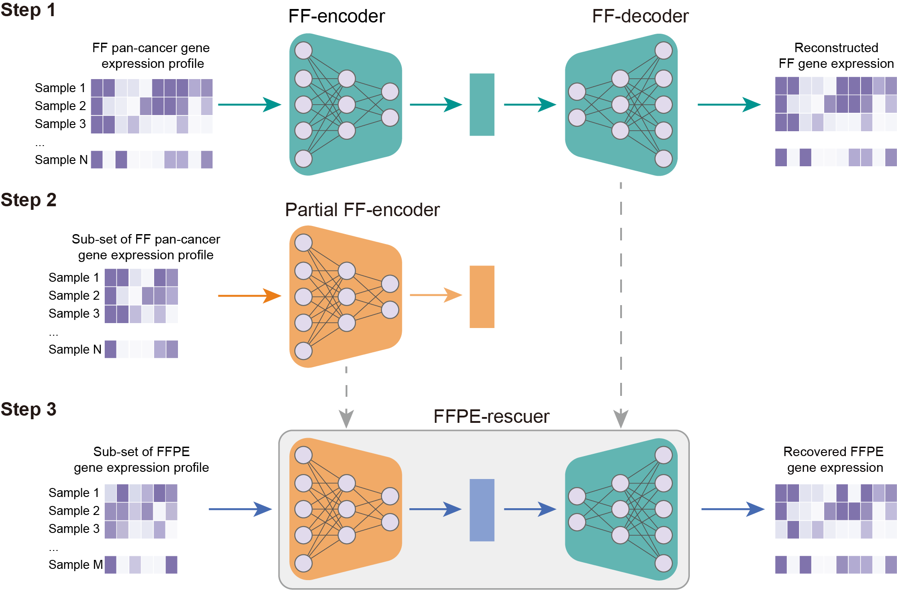

# FFPE-rescuer

## **Introduction**

The repository provides a convolutional autoencoder for recovery of formalin-fixed paraffin-embedded (FFPE)-derived gene expression data from RNA-sequencing.

FFPE tissue samples often show degradation of RNA due to fixation and storage processes; consequently, the RNA-sequencing data from FFPE samples for molecular analysis of cancer are not comparable to those obtained from fresh frozen (FF) tissues. We developed a deep learning (DL)-based framework that used 9568 FF primary tumor samples from The Cancer Genome Atlas across 28 cancer types and the given dataset to recover gene expression profiles in a given FFPE dataset.

**Figure 1 Constructing a recovery network using CNN for FFPE-derived RNA-seq data.** Schematic diagram of recovering FFPE-derived gene expression including training two networks and combining them. In the first step, the pan-cancer gene expression profile from FF tissue in TCGA was used to train an autoencoder network (comprising FF-encoder and FF-decoder). Then, a sub-set of the FF pan-cancer gene expression profile with fewer number of genes was used to train the partial FF-encoder. In the third step, partial FF-encoder and FF-decoder were combined to create FFPE-rescuer, which was used for recovering FFPE-derived gene expression profile. FFPE-rescuer takes a small number of input genes while output a profile with a large number of genes.

## **Prerequisites**

Python >= 3.5
